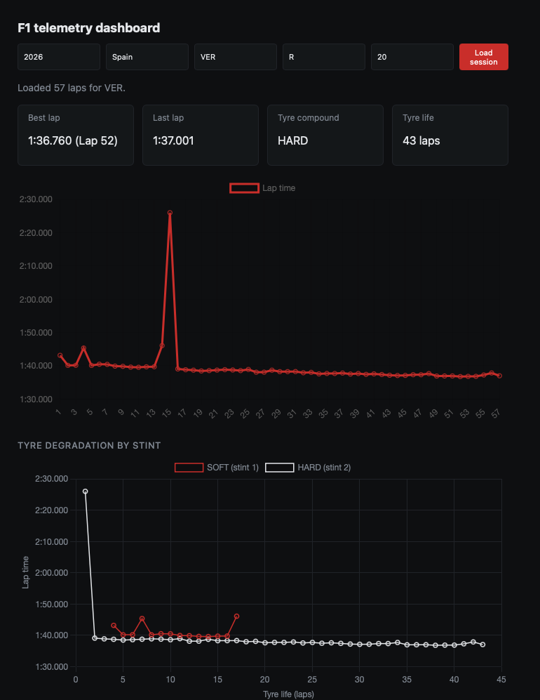
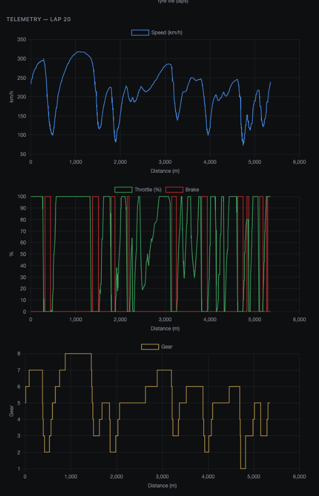

# F1 Telemetry Dashboard

A web dashboard for exploring historical Formula 1 race data. Pick a season, track, driver and session, and the app shows lap times, tyre degradation per stint, and detailed per-lap telemetry.

Built with **FastAPI** + **FastF1** on the backend and **Chart.js** on the frontend.

## Features

- **Lap time chart** for every lap of a session, with times formatted as `m:ss.mmm`
- **Summary cards**: best lap, last lap, tyre compound and tyre life
- **Tyre degradation chart**: laps grouped into stints (by compound and pit stops) and plotted as lap time vs. tyre life
- **Per-lap telemetry** plotted against distance:
  - Speed (km/h)
  - Throttle and brake (0-100)
  - Gear

Telemetry uses distance (not time) on the x-axis, so different laps line up point-for-point on the track.

## Screenshots

### Lap times and tyre degradation



### Per-lap telemetry



## Tech stack

| Layer    | Tools                          |
|----------|--------------------------------|
| Backend  | Python, FastAPI, FastF1, pandas |
| Frontend | HTML, CSS, vanilla JavaScript, Chart.js |

## Project structure

```
.
├── backend/
│   └── main.py          # FastAPI app and FastF1 data access
├── frontend/
│   ├── index.html
│   ├── style.css
│   └── app.js
├── fastf1_cache/        # FastF1 cache (git-ignored)
└── README.md
```

## Getting started

### 1. Clone and set up the environment

```bash
git clone <your-repo-url>
cd <your-repo-folder>

python -m venv venv
source venv/bin/activate      # Windows: venv\Scripts\activate

pip install fastapi uvicorn fastf1 pandas
```

### 2. Create the cache folder

FastF1 stores downloaded session data locally. The backend expects this folder in the project root:

```bash
mkdir fastf1_cache
```

### 3. Run the backend

Run it from inside the `backend/` folder (the cache path is relative):

```bash
cd backend
uvicorn main:app --reload
```

The API is now running at `http://localhost:8000`.

### 4. Open the dashboard

Go to **http://localhost:8000/static/**

Fill in the form and press **Load session**. The first request for a given session can take a while because FastF1 has to download and cache the data; later requests are much faster.

## API

| Endpoint     | Parameters                                                         | Description                          |
|--------------|--------------------------------------------------------------------|--------------------------------------|
| `GET /laps`      | `year`, `track`, `driver`, `session_type` (default `R`)        | All laps for a driver in a session   |
| `GET /telemetry` | `year`, `track`, `driver`, `lap_number`, `session_type` (default `R`) | Telemetry samples for a single lap |

Example:

```
GET /laps?year=2024&track=Silverstone&driver=VER&session_type=R
GET /telemetry?year=2024&track=Silverstone&driver=VER&session_type=R&lap_number=20
```

- `session_type`: `R` (Race), `Q` (Qualifying), `FP1` / `FP2` / `FP3` (practice)
- `driver`: FastF1's 3-letter driver code (e.g. `VER`, `HAM`, `LEC`)
- `track`: event name or location as accepted by FastF1 (e.g. `Silverstone`, `Spain`)

## Notes

- Only historical data is supported for now (no live timing).
- CORS is currently open (`allow_origins=["*"]`) for local development. Restrict it before deploying anywhere.

## Roadmap

- Overlay and compare telemetry from two laps or two drivers
- Live session data
- Additional metrics (RPM, sector times)

## Acknowledgements

Data provided through the [FastF1](https://github.com/theOehrly/Fast-F1) library.